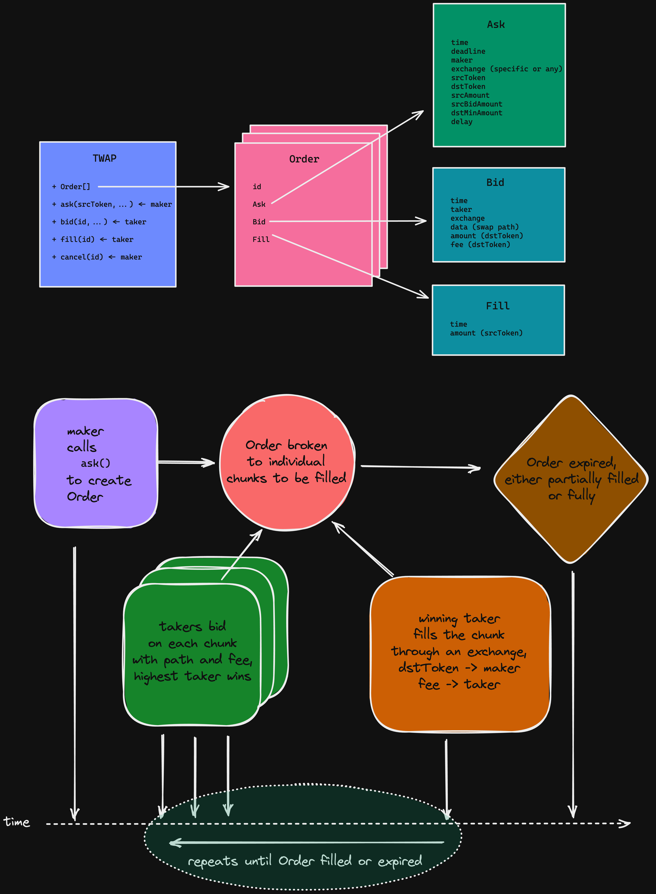

# TWAP

> Time-Weighted Average Price

## Security Audit Reports
- ### [PeckShield](./Audit-Report-PeckShield.pdf)
- ### [RDAuditors](./Audit-Report-RDAuditors.pdf)

## Summary

This smart contract allows the incentivized execution of a [TWAP](https://en.wikipedia.org/wiki/Time-weighted_average_price) order (either a 
[Limit Order](https://en.wikipedia.org/wiki/Order_(exchange)#Limit_order)
or a [Market Order](https://en.wikipedia.org/wiki/Order_(exchange)#Market_order))
**on any DEX**, with the possibility of partial fills.
A TWAP order breaks a larger order down into smaller trades or "chunks", which are executed over a set period of time.
This is a common strategy in traditional finance but it was not previously possible to execute such trades in a decentralized manner in DeFi systems.

In this smart contract, users (makers) create orders that wait in the contract to be filled. Once made, these orders enable an 
[English Auction](https://en.wikipedia.org/wiki/English_auction) bidding war on each chunk at its time interval.
Anyone willing to participate can serve as a “taker” by finding the best path to fill the order for the next chunk on any DEX,
within the parameters set by the maker. Takers submit these paths as a bid to the contract, which selects the winner based on criteria described in detail below.

The winning taker receives a portion of the output tokens as a reward for their effort.

One honest taker (i.e., a taker who is willing to set the fee at the minimum amount needed to cover gas costs)
is enough to ensure the entire system functions effectively at spot prices.

The contract is set to operate only up to the year 2106 (32bit timestamps), at which point it will no longer be usable.

> The `TWAP` Smart Contract does not hold any funds, has no owners, administrators, or other roles and is entirely immutable once deployed on an EVM blockchain.

## Use Cases

TWAP has several major benefits for users and trading platforms alike.

### [Price impact](https://coinmarketcap.com/alexandria/glossary/price-impact) reduction
TWAP orders can limit the disproportionate price impact that often occurs when making large orders or long-tail low liquidity token pairs,
especially on DEX/AMMs where liquidity is often fragmented among pools and prices are volatile.

Users should take into account the following considerations when using TWAP orders for this purpose:
* The gap between chunks should be sufficient to give arbitrageurs the time to close any price discrepancies that might occur in the affected pools after a trade and bring the reserves back to equilibrium (on par with spot price).
* Within this constraint, users should in most cases try to set the relevant time periods to be relatively short (i.e., a total duration of 5-30 minutes, with the interval 
  between chunks of about 1-5 minutes).
  This allows the maker to enjoy maximum benefits, as keeping the order duration as short as possible minimizes the risk of market price volatility, while still allowing 
  arbitrageurs sufficient time to close the gap, effectively increasing liquidity on the same pools.
* Additional consideration should be given to the amount of chunks, as executing trades for more chunks requires the user to expend more gas costs on the total order, which can 
  add up to more than the benefit gained from spreading over time.
* Note that gas costs will eventually be rolled onto the `maker`, as takers will only be willing to bid if they can economically benefit from filling the transaction,
  which means that they will require a gas fee, at minimum. Users can therefore expect that, at minimum, a fee equal to the gas fee will be included by the taker in any bid.  
  However, the presence of one honest taker who is willing to take only reimbursement for their gas fees as payment is enough for the entire system to function as efficiently as possible.
* A limit order (tight `dstMinAmount`) may also be only partially filled if price moves away while the order is in flight.

###  Long term [DCA strategy](https://en.wikipedia.org/wiki/Dollar_cost_averaging)
Dollar-cost averaging (DCA) is an investing strategy where the investor purchases an asset or set of assets having a certain dollar value on a specific schedule
(i.e., on the first day of every month). TWAP trades can be used to generate an automated version of this strategy.

Users should take the following into account when using the TWAP contract for this purpose:
* By setting duration to be very long in the future (even years in advance), setting a high allowance and holding the entire amount of tokens, a maker can effectively implement 
  an automated DCA bot that is resilient to price manipulations and requires no other action from the maker.
* Assuming there is one honest taker, setting a market order (near `0 dstMinAmount`) and a long delay will create a bidding war on the next chunk on a periodic basis (can be 
  daily, weekly or monthly), while ensuring a price that is very close to spot market price.
* The order will be visible on chain, and as bidding and execution can be predicted, some orders may be large enough to create an incentive for bidders to attempt to manipulate 
  price across all markets just before it is executed. Due to this issue, utilizing TWAP for DCA is better reserved for large-cap "base" assets that are not easily susceptible to price manipulation of their entire market cap.

## Architecture

### Actors

* `maker`: User, the Order creator. In order to execute orders, is required to have an input token (`srcToken`) balance and provide an approval to be swapped by the `TWAP` 
  contract on a specific (or any) `exchange`.
  * Controls all Order restriction parameters such as limit price, expiration and the length of delay between chunks.
* `taker`: Incentivized independant participators that monitor Orders submitted by makers.
  * Takers try to find the best path for relevant chunks and submit bids for those chunks, including a `fee` for the taker.
  * `dstFee`: **0 or more** of the `dstToken` output (i.e., the token the `maker` is purchasing) to be sent to the `taker` at the time the chunk is filled.
  * Spends the effort needed to find the best path, and risks being out-bid in the bidding war by another taker with a better path or lower fee.

### State diagram and execution flowchart



#### [TWAP](./contracts/TWAP.sol) contract holds the order book, which is an array of all `Orders`.

Before an Order can be filled, makers sign a transaction giving approval to the TWAP contract to remove the applicable input asset from their wallet.

#### [Order](./contracts/OrderLib.sol) is created by a `maker`, who, after granting the approval, sends an `ask` transaction to the TWAP contract containing certain requested parameters (specified below).

Takers monitor the Orders held by the contract, and can send bid transactions specifying the DEX on which it proposes to execute the next chunk, the output amount it can receive and the requested fee.
As a result of this process, an `Order` is generated and held in the `TWAP` contract, which contains the following parameters and constraints:

* `id`: the index in the order book, generated
* `status`: canceled, completed, or deadline
* `filledTime`: last chunk filled timestamp
* `srcFilledAmount`: total filled amount in `srcToken`
* `Ask`: holds the order parameters requested by the maker in the `ask` transaction
  * `time`: order creation timestamp
  * `deadline`: order duration timestamp, required
  * `delay`: minimum delay in seconds between chunks, required, must be `>MIN_FILL_DELAY_SECONDS`
  * `maker`: order creator (`msg.sender`)
  * `exchange`: swap only on this exchange, or zero for any exchange
  * `srcToken`: input token, required
  * `dstToken`: output token, required
  * `srcAmount`: input total order amount in `srcToken`, required
  * `srcBidAmount`: input chunk size in `srcToken`, required
  * `dstMinAmount`: minimum output chunk size, in `dstToken`, required. Can be higher than market output (implies a limit order), or as low as 1 wei
    (implies a market order)
* `Bid`: empty until the first `bid` received. Once bids begin to be received, holds the current winning bid information:
  * `time`: bid creation timestamp
  * `taker`: the winning bidder
  * `exchange`: execute bid on this exchange, never zero on a valid bid
  * `dstAmount`: output amount for this bid after fees in `dstToken`
  * `dstFee`: requested by `taker` for performing the bid and fill, in `dstToken`, may be `0`
  * `data`: swap data passed to exchange, expected output = `dstAmount` + `dstFee`

#### Once an order is created, it waits in the contract to be filled, when viable

#### The smart contract checks every bid transaction received to ensure that the following conditions are met:
* The order has not been previously cancelled, and the deadline has not passed.
* The maker granted the TWAP contract an `allowance` to swap the `srcToken`, with the approval covering an amount that is high enough to fill the next chunk.
* The maker has a high enough `balance` of the `srcToken` to be swapped (for the next chunk).
* The last chunk of the order was not filled too recently and there has been a sufficient delay between chunks.
  * The `delay` is set by the order maker, minimum `MIN_FILL_DELAY_SECONDS`
* If the order maker specified that a particular `exchange` would be utilized for the order, only that `exchange` can be used to swap. If the value is set to `zero`, any exchange can be used.
* The current bid output after fees is higher than the previous winning bid.
* The current bid output after fees is higher or equal to the minimum set by the order maker.
* To avoid stale unfilled bids, a bid older than `MAX_BID_WINDOW_SECONDS` will be cleared and removed.

Any invalid constraint will revert the `bid` transaction, so a successful transaction implies a win

#### A winning bid can be filled (executed) only after a minimum delay of `MIN_BID_WINDOW_SECONDS`, with the specific time period set by the maker.
This delay gives other bidders an opportunity to make a competing bid, allowing for a bidding war on the applicable chunk.

* Each succesfsul bid allows for another `MIN_BID_WINDOW_SECONDS` interval to challenge it.
* If no other bid is set as the new winner, the current `taker` (winning bidder) can fill the bid by calling `fill(id)`.
* When receiving the `fill` transaction, the `TWAP` contract performs the same verifications as when bidding.
* Once verified, the `fill` transaction also utilizes the allowance previously provided by the maker to perform the actual swap on the requested exchange, resulting in the 
  transfer of the input tokens from the maker to the exchange, and the transfer of the output tokens from the exchange back to the maker.
* If `dstFee` is set `>0`, the specified fee is paid out to the winning taker as part of the completion of the order, out of the `dstToken` amount of that swap.
* All of the above transfers are contained and set within the valid `fill` transaction.

#### This structure creates an incentive for takers to find a path that is advantageous for the bid, as a higher return of output tokens enables the fee to be as high as possible

#### But, the presence of one honest taker, who is willing to set the fee such that it takes only enough to reimburse it for the gas fees incurred, will ensure that the order will be filled to as close a price to the spot market as possible.

This is because this honest taker, by charging a lower fee, will propose a transaction containing the highest output to the maker and will therefore be selected as the winning 
bid when competing with those charging higher fees, all other things equal.
Therefore, if the honest bidder is equally capable of locating the best path as any competing taker, the price received by the maker will be optimal.

Please note the following additional features of the TWAP contract:

* An order can be canceled any time by the maker.
* An order can be only partially filled, due to market price volatility (unfilled limit orders), or expiration.
* The maker must ensure that it has granted approval and has a sufficient balance of `srcToken` for each chunk before that chunk is available for bidding. It does not have to 
  have the entire amount available and approved at the time of order creation.
* Stale orders, as well as any orders that are invalid, can be `pruned` (canceled), by anyone.


## Build Setup
- tests running on a specific block to ensure deterministic outcomes
- create free accounts on Alchemy (or similar archive node provider), etherscan and coinmarketcap
- create `.env` file with (or pass as environment variables):
```
NETWORK_URL_ETH="https://eth-mainnet.g.alchemy.com/v2/08***************************Kf"
NETWORK_URL_POLY="https://polygon-mainnet.g.alchemy.com/v2/a7***************************xN"
ETHERSCAN_ETH="VV***************************14"
ETHERSCAN_POLY="9H***************************WY"
COINMARKETCAP="81***************************36"
```
- workflow:
  - `npm install`
  - `npm run build`
  - `npm run test` (runs tests on all supported chains, currently Ethereum and Polygon)

[see tests output](./TEST_OUTPUT.md)
